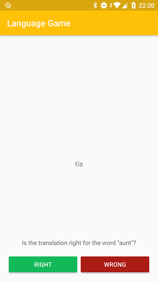
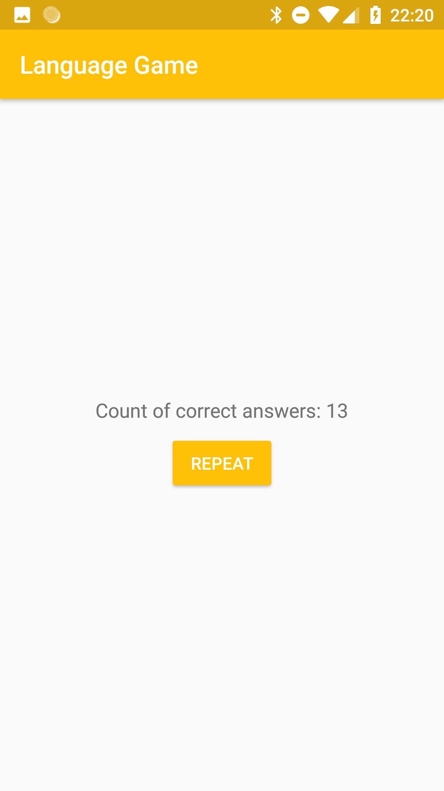

# Falling Words
Develop a simple language game app

Main technologies: **Kotlin, MVP, RxJava, Mockito**

# Rules

During one round the user will see 20 words pairs. At the bottom of the screen, the user sees the original word in English. For 6 seconds, the proposed version of the translation into Spanish will be dropped from the top of the screen to the bottom. During this time, the user must decide whether the translation is correct, using two buttons in the bottom of the screen. At the end of the round, the user will see the number of correct answers. If the user did not make a decision within 6 seconds, the answer is automatically considered incorrect.

# Short app description
The application consists of 2 main screens.

1) **Splash Activity** - activity for solving the problem of blank white page at the start of the app.

2) **Game Activity** - a main screen, game area

 

As the basic architecture I chose the MVP pattern without Data Injection. The reason I do not use this method of code organization is a small application size and limited use of specific libs, elements and classes. However, I would like to clarify that I consider that Data Injection is very effective in the case of development of big project. Plus I want to say that I have experience with Dagger2 library.

The second feature of the application is use cases. I think that such an organization of working with business logic is a good practice. This approach allows you to break complex algorithms into simpler components and simplifies the testing process.

# Time managment

It took me about 5 hours to complete this task.

* Concept, architecture - 30 min
* Model, data parsing - 30 min
* Views (layouts) - 30m
* SplashActivity, GameFragment - 1h
* Game mechanics, presenter - 1h 30m
* Unit tests - 30m
* Attempt to integrate the database - 30m

As you can see in the list above, part of the time was spent on trying to integrate the database. The main idea was to parse the file during the first run of the application and save the data to a local database. The reason for this decision was the rapid access to data and the convenient possibility of expanding data, for example, to add a new language. Unfortunately, I ran into some of the ORM database (DBFlow) limitations associated with randomly selecting of the rows. For this reason, there is currently no possibility of storing data in the database.

# Thing to improve or add

1. **A more detailed result screen.** At the moment, the user sees only the number of correct answers. This decision was made due to lack of time. I would like to provide the user with a more detailed report. I intended to use a new fragment and a RecyclerView to display a list of answers with a correct / incorrect mark and a right translation.

2. **Database.** As I mentioned above, I think that the database provides faster data access and benefits when working with large amounts of data, which will be a plus in the case of an extension of the word directory. As an additional option, when using the database, you can store the statistics of the user's games and monitor his progress.

3. **Additional tests.**
